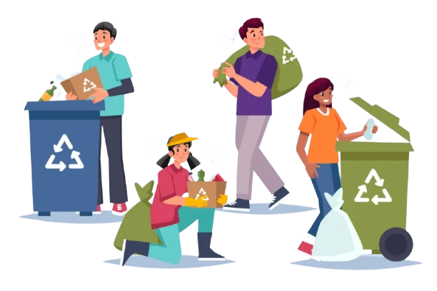

# SMART WASTE MANAGEMENT SYSTEM 

## Project Overview

Our project is a smart waste management system that aims to make the process of waste collection more efficient. The system utilizes waste bins and manages them through mobile and web applications. With the help of the system, users can easily check the status of the bins and follow a schedule for waste collection based on the bin's status. Our primary focus is on house owners, garbage collectors, and municipal authorities who serve as administrators in the system. The system is designed to make waste management easier and more effective for everyone involved.

- Software setup: Mobile application for house owners and garbage collectors; Web application for municipal authorities.
  

  
  

## Technological Stack

- **Frontend:**
  - React.js for the web application.
  - React Native for the mobile application.

- **Backend:**
  - Node.js with Express for server development.
  - MongoDB for the database.

- **Authentication:**
  - JWT (JSON Web Tokens) for secure authentication.

- **Security Measures:**
  - Passwords hashed using bcrypt.
  - HTTPS for secure data transmission.

## Future Enhancements
**We are eagerly planning to make it**
  - Connected and work through Iot Devices.
  - able to use automation, after hardware implementation, using Machine Learning features.

## Project page

[EcoBin Smart](https://github.com/Harshitpant12/smart-waste-management-system)

